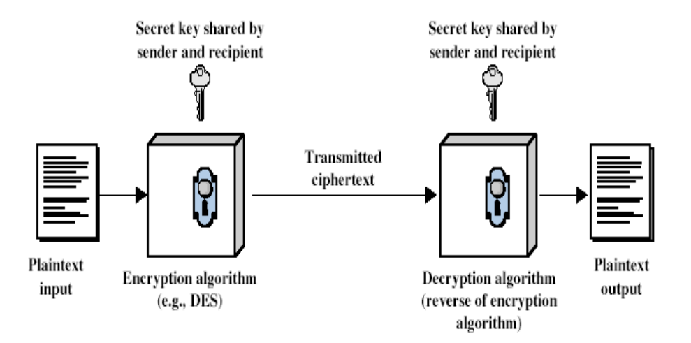
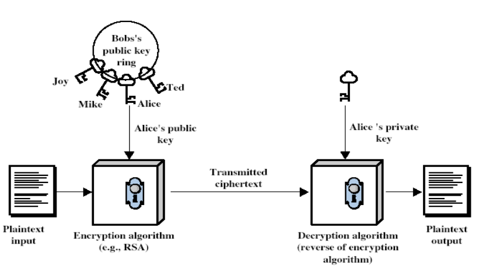
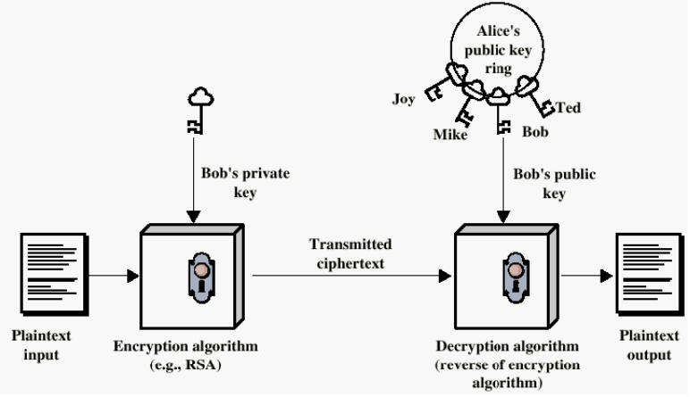
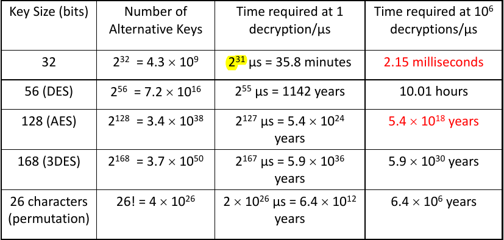

# Introduction

### What is Cryptography?

*"**Crypto algorithms** are the equivalent of locks, seals, security stamps and identification documents on the Internet. They are essential to protect our on-line bank transactions, credit cards, and personal information and to support e-commerce and e-government"*

| Term | Definition |
| :---- | :--------- |
| Cryptology | The study of secure communication, which surrounds both Cryptography and Cryptanalysis. |
| Cryptography | The study of encryption (including decryption) principles/methods that allows only the sender and intended recipient of a message to view its contents.|
| Cryptanalysis | The study of principles/methods of decrypting cipher text without knowing the key (often used by the attacker) |
|||
| Intelligible  | can be known as meaningful or capable of being understood | 

### Basic Terminology
| Term | Description |
| :--- | :---------- |
| Plaintext | original message |
| Ciphertext | encrypted message |
| Cipher / Cryptographic System | pair of algorithms for transforming plaintext to ciphertext and ciphertext back to plaintext. |
| Key | info used in cipher that are known only to `Sender/Receiver` |
| Encrypt | the process of converting plaintext to ciphertext |
| Decrypt | the process of recovering plaintext from ciphertext |

## Kerckhoffs' Principle

> Everything can be made public (including the algorithms) except the `private key`.

---
### Cryptography is broadly classified into two categories:
1. Symmetric / Private-Key Cryptography
2. Asymmetric Key Cryptography / Public-Key Cryptography

#### Symmetric Cryptography (Private-Key)
- Traditional/secret-key/single-key cryptography
- both the `Sender` and `Recipient` share a common key, `private key`
- rely on one key to both `encrypt` and `decrypt`
- If the key is disclosed, communication are compromised.
- think of it like a traditional house door key, to unlock/lock it requires the common key.

### Private-Key Encryption Model

#### Asymmetric Cryptography (Public-Key)
- Involves the use of two keys:
	- public-key - the recipient public key can be known by anyone and is used to encrypt the messages by the sender, and verify signatures.
	- private-key - only known to the recipient, and is used to decrypt the ciphertext and sign signature.
- Therefore the `Sender` who encrypt messages or verify signatures **cannot** decrypt messages or create signatures.
+ Developed to address two key issues: 
	+ Key distribution - how to have secure communications in general without having to trust a key distribution center (KDC) with your key.
	+ Digital signatures - how to verify a message comes intact from the claimed sender.
+ Invention due to *Whitfield Diffie & Martin Hellman* at Stanford University in 1976.

### Public-Key Encryption Model

### Authentication using Public-Key System (Digital Signature) 

### Unconditional Secure Cipher

 Even having unlimited computer power and time, the secure ciphertext still cannot be broken (decrypt); Since the ciphertext itself does not provide sufficient information to uniquely determine the corresponding plaintext.
 
>An encryption scheme is **unconditionally secure** if the ciphertext generated by the scheme does not contain enough information to uniquely determine the corresponding plaintext, no matter how much ciphertext (computer power) is available.

### Computational Secure Cipher

Given that the current computing resources (which are limited), the ciphertext cannot be broken due to the time needed to decrypt the ciphertext outweigh the content of the message.

> An encryption scheme is said to be **computationally secure** if: (1) the cost of breaking the cipher exceeds the value of the encrypted information, and/or (2) the time required to break the cipher exceeds the useful lifetime of the information given limited computing resources (e.g. time needed for breaking a cipher is greater than the age of the universe).

### Two general approaches to attacking an encryption scheme:

#### Cryptanalytic Attack

| Term | Description |
| :--- | :---------- |
|  Ciphertext only (COA) | Only know algorithm & ciphertext, is statistical, know or can identify plaintext |
| Known plaintext (KPA) | Know/suspect plaintext & ciphertext to attack cipher based on some plaintext-ciphertext combinations have been known in the past. |
| Chosen plaintext (CPA) | Select plaintext and obtain ciphertext to attack cipher. The attacker has access to the encryption machine. |
| Chosen ciphertext | Select ciphertext and obtain plaintext to attack cipher. The attacker has access to decryption machine. |
| Chosen text | Select plaintext or ciphertext to en/decrypt to attack cipher |

#### Brute Force Attack
+ Try every possible key on a piece of ciphertext until an intelligible translation into plaintext is obtained.
+ On average, half of all possible keys must be tried to achieve success.
	+ Always possible to simple try every key
	+ Most basic attack, proportional to key size
	+ Assume either know/recognize plaintext

#### Difference between a *block cipher* and a *stream cipher*?

+ **Block cipher** processes messages in blocks such as 64 bits or more at a time, each of which is encrypted / decrypted.
+ On the contrary, the **Stream cipher** process message 1 bit / byte (as a stream) at a time when encrypting and decrypting.
+ In summary: A **block cipher** is one in which a block of plaintext is treated as a whole and used to produce a ciphertext block of equal length while a **stream cipher** is one that encrypts a digital data stream one bit or one byte at a time.

