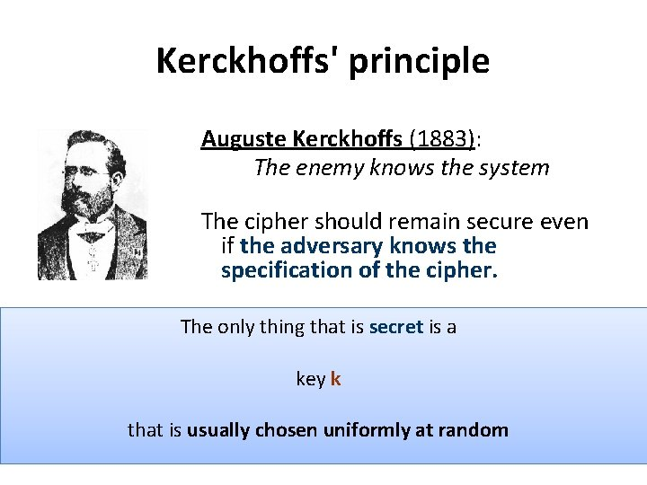

# Introduction

| Term | Definition |
| :---- | :--------- |
| Cryptography | The study of encryption (including decryption) principles/methods that allows only the sender and intended recipient of a message to view its contents.|
| Cryptanalysis | The study of principles/methods of decrypting cipher text without knowing the key (often used by the attacker) |
|||
| Intelligible  | can be known as meaningful or capable of being understood | 

## Kerchoffs' Principle

> Everything can be made public (including the algorithms) except the `private key`.
