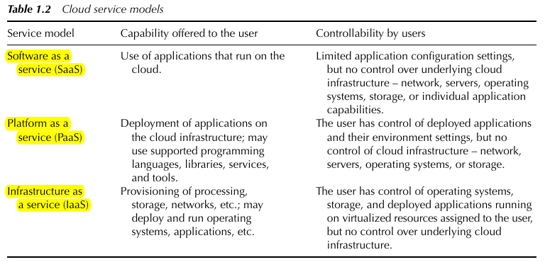

# Introduction to Cloud Computing

### NIST Definition of the term *Cloud Computing*
> "Cloud computing is a model for enabling ubiquitous, convenient, on-demand network access to a shared pool of configurable computing resources (e.g., networks, servers, storage, applications, and services) that can be rapidly provisioned and released with minimal management effort or service provider interaction."

### ISO Definition of the term *Cloud Computing*
> "Cloud computing is a paradigm for enabling network access to a scalable and elastic pool of shareable physical or virtual resources with self-service provisioning and administration on-demand."

### Simplistic terms of *Cloud Computing* by *Gartner*
> "A style of computing where scalable and elastic IT-enabled capabilities are provided as a service to multiple customers using Internet technologies."

### Key Characteristics of *Cloud Computing*
| Cloud  characteristic  | Description |
| :--------------------- | :---------- |
| On-demand self-service | Allows consumers (customers) to automatically request the service based on their needs, without human interaction with the service provider.  |
| Broad network access | Various devices can access through heterogeneous thin or thick client platforms (e.g., smartphones, tablets, laptops). |
| Resource pooling | Computing resources (e.g. storage, processor, memory) are pooled together to serve multiple consumers, and are dynamically assigned and reassigned according to demand. The exact location of the resources are hidden from the consumer (customer). |
| Rapid elasticity | Having the capabilities to scale up/down rapidly corresponding to the demands. |
| Measured service | Automatically control and optimise resource use by leveraging a metering capability at some level of abstraction appropriate to the type of service (e.g., storage, processing, bandwidth, and active user accounts). |
| Multi-tenancy | A shared resource that draws on resource pooling as an important feature. It implies use of same resources by multiple consumers, called tenants.

### Definition
> **Ubiquitous access** = capable of being able to access anywhere and anytime.

### Three Major Categories of Cloud Service Models
- `Software as a Service (SaaS)`
- `Platform as a Service (PaaS)`
- `Infrastructure as a Service (IaaS)`

| Cloud Service Models | Description |
| :------------------- | :---------- |
| Software as a Service | An application hosted by a cloud vendor and delivered as a service to users. It eliminates the hassle to install and run the application locally.|
| Platform as a Service | The platform and tools for application development and middle-ware systems are hosted by a vendor and offered to application developers, allowing them simply to code and deploy without directly interacting with the underlying infrastructure. |
| Infrastructure as a Service | Outsource raw computer infrastructure (e.g., servers, CPU, storage, network equipment) to client for the duration that they need them. |

### Five Categories of *Cloud Models*
| Cloud Model | Description |
| :------------ | :---------- |
| Public Cloud | Most common and widely known form of cloud, and is open for anyone (business, industry, government, nonprofit organisations and individuals - to use.) Cloud infrastructure are owned and managed by the cloud service provider.|
| Private Cloud | Cloud deployed, provided, and controlled by an enterprise behind its firewall for its own use.
| Virtual Private Cloud | A secure, isolated private cloud hosted within a public cloud. The customer can do anything else they would do in the private cloud, however the Virtual Private Cloud (VPC) is hosted remotely by a public cloud provider. A perfect example will be MMLS. |
| Community Cloud | An industry cloud or vertical cloud. It is optimised and specially deployed for use by a particular industry sector. |
| Hybrid Cloud | A combination of two or more of the above cloud models. For example, an enterprise make use of both public and private clouds - thus deploying business-critical core application on the internal private cloud, and less critical services on a public cloud. |

### Benefits of *Cloud Computing*
- lower operational and service cost to users - `pay-per-usage` model
- on-demand scalability to meet peak and uncertain computing demands
- shared access to data
- freedom to use

All the information listed here can be found from [here](./img/TCC3141-Week1-IntrotoCloudComputing.pdf).
