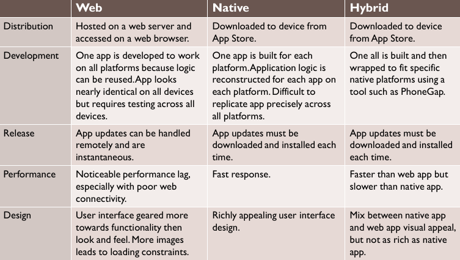
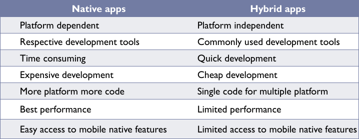

# Introduction to Integrative Programming

## Difference between Compiler and Interpreter
---
1. A **Compiler** will scan and translate source codes in whole (such as C/C++, JAVA, Objective-C language) into machine language (binary number such as `0` and `1`) which will generate an `.exe` file at the end of compiling.

2. **Compiler** takes time to analyse the source codes (such as C/C++, JAVA, Objective-C language). It generates all the errors at the end of compilation, making debugging difficult. However, the time taken to execute the process is much quicker than Interpreter.
> A given example will be, the compiler generates errors messages for `Section A`, `Section B`, and `Section C`. As a matter of fact, it is just the error in the `A Section`, causing `B` and `C` to generate those errors. Thus, making the debugging process difficult. 

3. An **Interpreter** translates program code (such as Python, JavaScript, PHP) into machine code. It translates just one statement of the program at a time (equivalent to line by line).

| Type | Compiler | Interpreter |
| :--- | :--- | :--- |
|||
| **Translate Method** |A compiler translate the entire code in one shot  | Translate only a single instruction at a time |
|||
| **Intermediate** **Codes**| Generate machine code (binary file such as `.exe`, hence requires more memory| Never produce intermediate machine code, hence are memory efficient |
|||
| **Speed** | Faster Execution | Slower Execution | 
|||
| **Error** | All Errors are displayed after entire program is checked | Error are displayed for every instruction interpreted (if any) which stops |
|||
| **Debug** | Debugging is very difficult (slow) | Debugging is easier (quick) |
|||
| **Examples** | C/C++, JAVA, Objective-C | Python, PHP, JavaScript |
> Table 1 . Difference between Compiler and Interpreter

---

### Three Categories of Mobile apps

| Type of App | Description |
|:----------- |:----------- |
| Web         | Hosted on web browser, which in fact is a websites. Support multi-platform,and low development cost. |
| Native      | Built using platform-specific software development tool provided by the mobile OS, which can fully utilise the mobile API. App support on the specified OS ONLY.            |
| Hybrid      | Combines native development with web app technology by using native wrapper with limited API access. Somehow similar to Discord. Worse performance `than Native app`            |

