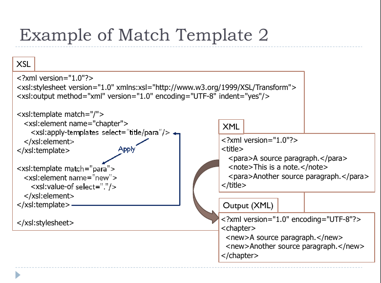
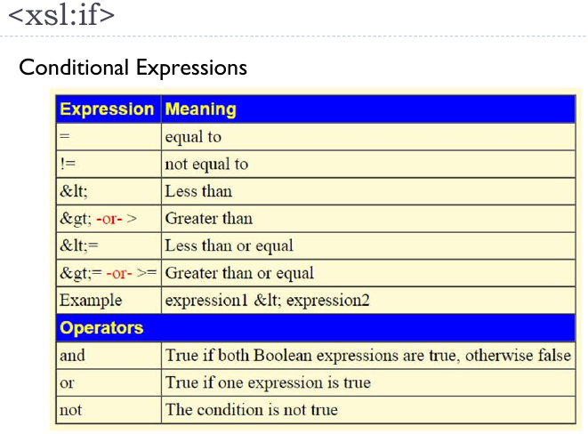
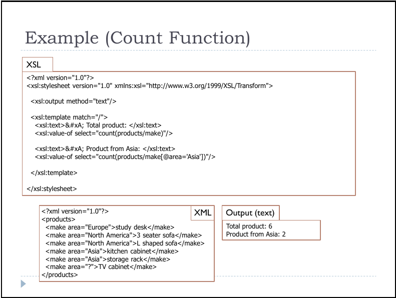

# XSLT - [eXtensible Stylesheet Language](https://www.w3schools.com/xml/xsl_intro.asp)

The basics of XSLT is to create templates that match the nodes in the structure.

+ When XSLT processes a document, it recursively traverses the entire document hierarchy, inspecting each node, looking for a template that matches the current node.
+ When a matching template is found, the contents of that template are evaluated.

### Two type of templates:

 + Match (Unnamed) Templates
 + Named Templates

`<xsl:template>` is used to build a template

`<xsl:apply-templates>` applies a template rule to the current element or to the current element's child nodes.
+ the *select attribute* traverses the *node that matches XPath expression*
+ If select attribute is not provided, it traverses all children of the context node
> If select attribute is included, but does not match any nodes, nothing is traversed and nothing happens.


## Match (Unnamed) Templates

### Example of Match Template

```xml
<?xml version="1.0"?>
<title>
<para>A source paragraph.</para>
<note>This is a note.</note>
<para>Another source paragraph.</para>
</title>
```

```xml
<xsl:template match="/">
. . .
</xsl:template>
```

```xml
<xsl:template match="title/para">
. . .
</xsl:template>
```

+ The match attribute specifies which node the template should be invoked.



`<xsl:element>` create an element node in the output document.

`<xsl:attribute>` create an attribute node in the output document.

`<xsl:variable>` element declare a local or global variable.
`<xsl:value-of>` extracts the value of a selected node through the XPath expression.

## Named Template

**Named templates** operate like functions in traditional programming languages.

+ accept arguments and run only when explicitly called
+ `<xsl:param>` is used to define a parameter in a template
```xml
<xsl:param name="parameter" select="default value">
```

### Example of Named Template

```xml
<xsl:template name="my-template">
<xsl:param name="a" select="'false'"/>
<xsl:param name="b" select="book"/>
<xsl:param name="c"/>
<!-- ... body of the template ... -->
</xsl:template>
```


`<xsl:call-template>` invokes a named template in a script.
>The name attribute is required and it defines the name of the template being called.

`<xsl:with-param>` pass arguments into the template.
> The value of the name attribute must match the parameter defined in the actual template; otherwise the parameter is ignored.

`<xsl:for-each>` element loops over all the nodes in the nodelist of the XPath expression that appears as the value of the select attribute.

`<xsl:sort>` element sort elements in a variety of ways.
> the default for the sort elements is to sort **alphabetically**

`<xsl:if>` element is used for conditional processing.
> The instruction inside the `<xsl:if>` element are processed if the condition is true.

+ The condition appears as the value of the test attribute.
```xml
<xsl:template match="shop">
<xsl:if test="state = 'Melaka'">
...
</xsl:if>
</xsl:template>
```

```xml
<xsl:template match="shop">
<xsl:if test="price &gt; 10">
...
</xsl:if>
</xsl:template>
```



`<xsl:choose>` element is used in conjunction with `<xsl:when>` and `<xsl:otherwise>` to express test with multiple conditions.

#### Count Function

`count()` is the predefined function in XLST.
 + returns the total number of input nodes in a sequence
 + can be used to count elements with specific attribute names defined in the XML document.

