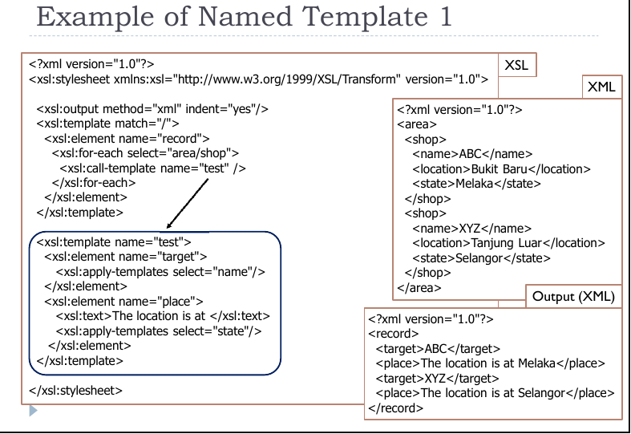
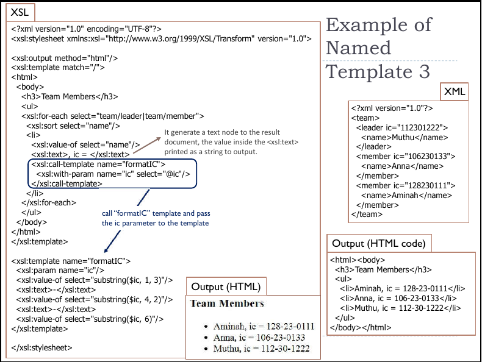

# XSLT - [eXtensible Stylesheet Language](https://www.w3schools.com/xml/xsl_intro.asp)

The basics of XSLT is to create templates that match the nodes in the structure.

### Two type of templates:
 + Match (Unnamed) Templates
 + Named Templates

`<xsl:template>` is used to build a template

## Match (Unnamed) Templates

### Example of Match Template

```xml
<?xml version="1.0"?>
<title>
<para>A source paragraph.</para>
<note>This is a note.</note>
<para>Another source paragraph.</para>
</title>
```

```xml
<xsl:template match="/">
. . .
</xsl:template>
```

```xml
<xsl:template match="title/para">
. . .
</xsl:template>
```

+ The match attribute specifies which node the template should be invoked.

`<xsl:element>` create an element node in the output document.
`<xsl:attribute>` create an attribute node in the output document.
`<xsl:variable>` element declare a local or global variable.
`<xsl:value-of>` extracts the value of a selected node through the XPath expression.

## Named Template

**Named templates** operate like functions in traditional programming languages.

+ accept arguments and run only when explicitly called
+ `<xsl:param>` is used to define a parameter in a template
```xml
<xsl:param name="parameter" select="default value">
```

### Example of Named Template

```xml
<xsl:template name="my-template">
<xsl:param name="a" select="'false'"/>
<xsl:param name="b" select="book"/>
<xsl:param name="c"/>
<!-- ... body of the template ... -->
</xsl:template>
```


> Example 1


> Example 2

`<xsl:call-template>` invokes a named template in a script.
>The name attribute is required and it defines the name of the template being called.

`<xsl:with-param>` pass arguments into the template.
> The value of the name attribute must match the parameter defined in the actual template; otherwise the parameter is ignored.

`<xsl:for-each>` element loops over all the nodes in the nodelist of the XPath expression that appears as the value of the select attribute.

`<xsl:sort>` element sort elements in a variety of ways.
> the default for the sort elements is to sort **alphabetically**
