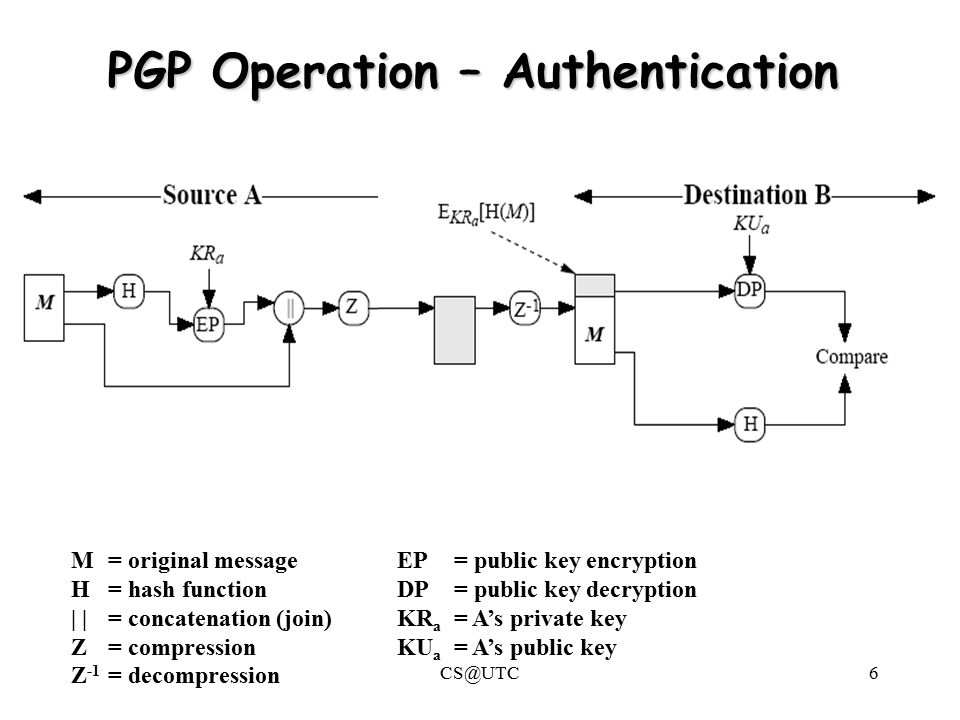
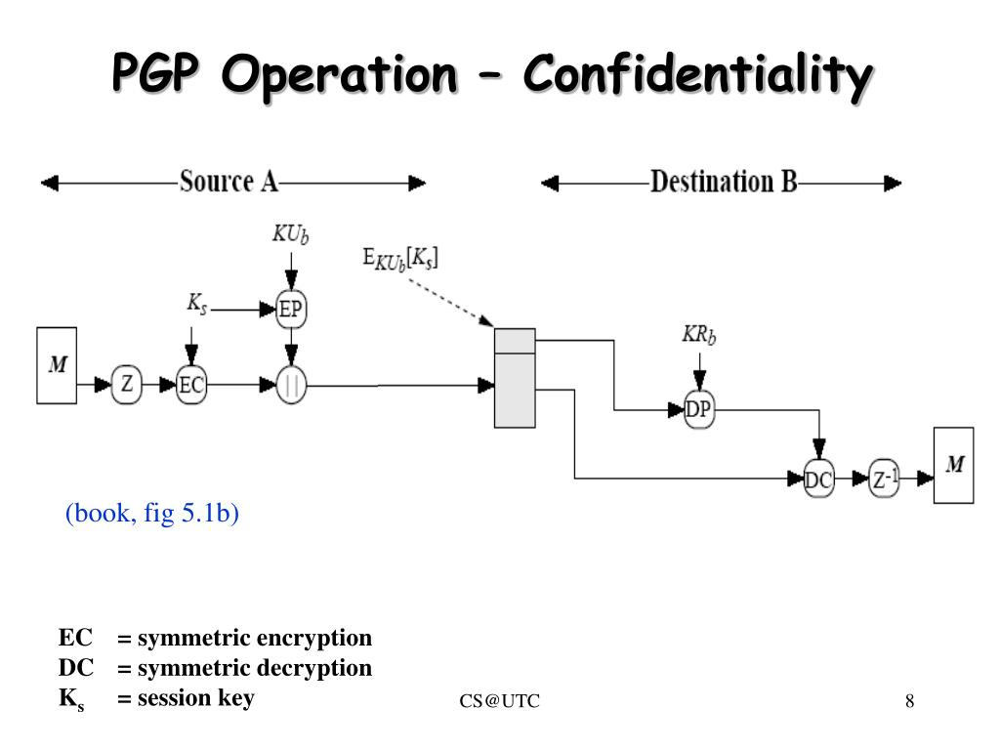

# Chapter 5: Electronic Mail Security

### Pretty Good Privacy (PGP)

+ popular program and open source
+ to provide **confidentiality** and **authentication** services for electronic mail and file storage
+ used primarily to **encrypt and decrypt email** over the Internet
+ designed by *Phil Zimmermann* in 1991

The following services offered by PGP:

1. Authentication
2. Confidentiality
3. Compression
4. Email Compatibility
5. Segmentation

As shown in the figure above, the **hash function *H*** will calculate the hash value of the message using ***SHA-1*** (where it generate a 160-bit hash value). Then, using the sender's private key ***KRa*** the hash code will be encrypted and it is called **Digital Signature**. After that, message will be appended to the signature. All the process that happened till now, is known as signing the message. And to reduce the overhead during transmission, the message will undergo compression before sending over to the receiver.

At the receiver end, the data is decompressed ***Z -1***, and the original message ***M*** and signature ***S*** are obtained. The signature is then decrypted using the sender's public key ***KUa*** and the hash value is obtained. The message is again passed to the **hash function *H***, and its hash value is calculated and obtained.

Both the values, one from signature and another from the recent output of hash function are compared. If both are the same, it conclude that the email is actually sent from a known one and is legit. Else, not a legit one.

As shown above, the message is first compressed and a random 128-bit session key ***KS*** is generated by the PGP to be used for this message only (symmetric encryption). Then, the session key ***KS*** itself get encrypted through public key encryption ***EP*** using the receiver's public key ***KUb*** 

Both the encrypted entities (encrypted compress message and encrypted session key) are now concatenated and sent to the receiver. The original message was compressed and then encrypted initially, to protect it from reading by unauthorized person. 

### Secure/Multipurpose Internet Mail Extension (S/MIME)

S/MIME is a security enhancement to the MIME Internet email format standard, based on technology from RSA Data Security.

It offer the ability to sign, encrypt message or both:

| Content Type  | Description 1 | Description 2 | 
| :--- | :--- | :--- |
| Enveloped Data | encrypted content and associated keys | an encrypted S/MIME entity, which is a Recipient Info block followed by encrypted message content. |
| Signed Data | encoded message + signed digest | a signed S/MIME entity, which consists of a series of blocks, including a message digest algorithm identifies, the message being signed, and SignerInfo. |
| Clear-Signed data | cleartext message + encoded signed digest | Signing process does not involve transforming the message to be signed, so that the message is sent in clear/plaintext.|
| Registration Request | apply to CA for public key certificate | transfer a certification request to CA (Certificate Authority) | 
| Certificates-Only Message | A message containing only certificates or a certificate revocation list (CRL) which is sent in response to a registration request. | |

S/MIME follow the following terminology below to specify requirement levels;

| | Requirement Levels of Algorithms Used |
| --- | --- |
| MUST | The definition is a **absolute requirement** of the specification. An implementation must include this feature or function to be in conformance with the specification. |
| SHOULD | There may exist valid reasons in particular circumstances to ignore this feature or function, but it is **recommended** that an implementation include the feature or function. |

