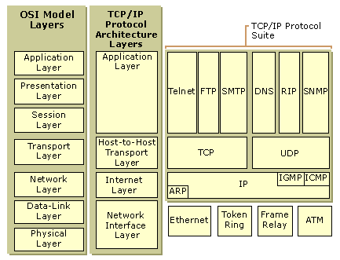
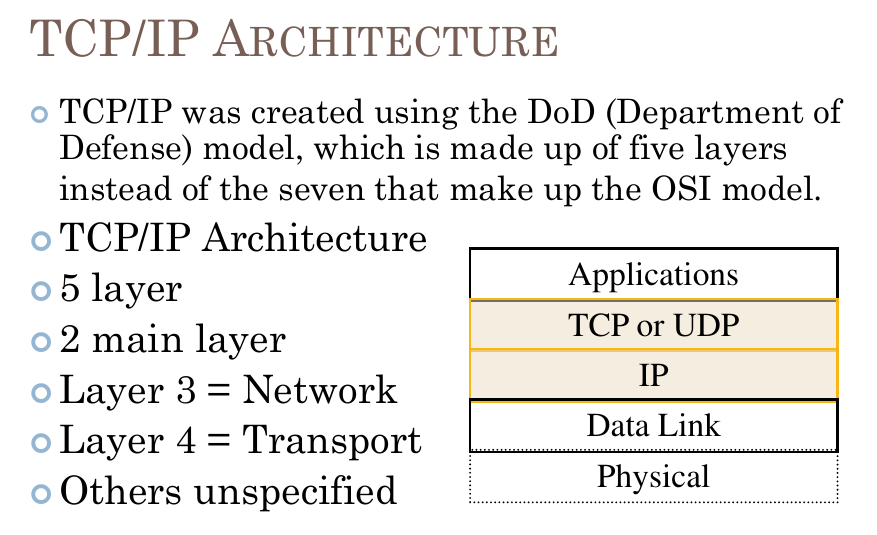

## TCP/IP ARCHITECTURE

| | TCP/IP Layers  | Equivalent to OSI Model Layers |
| ----- | :----- | :----- |
| 1. | Application Layer | Application Layer |
| 2. | Presentation Layer | 

1. Network Interface Layer
2. Internet Layer
3. Host-to-Host Transport Layer
4. Application Layer

---

---

## TCP (Transmission Control Protocol)
>1.  **Connection Oriented** transport protocol.
>
>2. **TCP** is a guaranteed method of transferring data (aka packets), where no data loss will be tolerated, the 3-Way Handshake mechanism take action between the Client and the Server.
>
>3.  **TCP** and **IP** are used together so often, in short the responsibility of IP protocol was to make sure that the packet reaches the right destination, and while the TCP protocol make sure that packets (or data) are not lost when transferring from the sender to the receiver.

## UDP (User Datagram Protocol)
>1. **Connection-less** transport protocol.
>
>2. UDP is a method of transferring data which allows partially of the data to be lost, for example,  Live Stream on YouTube

---

